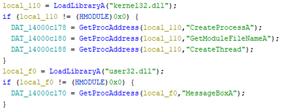
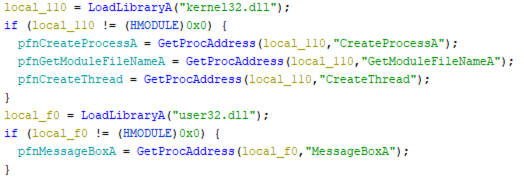
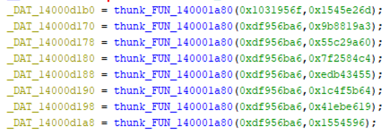
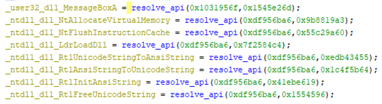

# Practical P-Code examples

## Introduction

P-Code is an intermediate representation used in Ghidra to describe the behavior of various processors.
During the decompilation process, Ghidra converts machine code into P-Code, applies various optimizations, performs control flow structuring, and finally emits pseudo-C source code.
The most important point here is that analysis can be made processor-independent by describing processor behavior with a common intermediate representation. This enables the support of the Ghidra decompilation for various processors.

The use of intermediate representations is also attractive for reverse engineers because it enables a processor-independent analysis (for example, [Alexei Bluazel's excellent article](https://www.riverloopsecurity.com/blog/2019/05/pcode/) shows the data-flow analysis using P-Code). However, to my best of knowledge, there are few examples to utilize the P-Code for automating reverse-engineering tasks.

This repository gathers the practical P-Code examples. I'm currently exploring the possibilities of P-Code, so there are just a few of the use cases here. If you know other interesting use-cases, pull-requests are welcome.

## About the sample scripts included in this repository

### [ModifyDecompileResultFromFunctionName.java](./ghidra_scripts/ModifyDecompileResultFromFunctionName.java)

The first example is the automatic renaming function pointer variables that are dynamically resolved at run-time. Resolving Win32 API addresses dynamically through `GetProcAddress` is commonly used to hide the imported APIs from static analysis tools. Here, I show a code snippet of [sample code](https://github.com/kohnakagawa/PracticalPCode/blob/main/SampleCode/ResolveByAPIName/Main.c#L42-L54) to illustrate this.

```c
	// NOTE:
	// The following Win32 API addresses are stored as global variables
	// Win32 API functions are called through these global variables
	HMODULE kernel32Base = LoadLibraryA("kernel32.dll");
	if (kernel32Base) {
		createProcessA = (pfnCreateProcessA)GetProcAddress(kernel32Base, "CreateProcessA");
		getModuleFileNameA = (pfnGetModuleFileNameA)GetProcAddress(kernel32Base, "GetModuleFileNameA");
		createThread = (pfnCreateThread)GetProcAddress(kernel32Base, "CreateThread");
	}
	HMODULE user32Base = LoadLibraryA("user32.dll");
	if (user32Base) {
		messageBoxA = (pfnMessageBoxA)GetProcAddress(user32Base, "MessageBoxA");
	}
```

The Ghidra raw decompile result of the above code is as follows. The global variables (e.g., `DAT_14000c178`, `DAT_14000c180`, and `DAT_14000c188`) hold the Win32 API addresses. You will want to rename these global variables to more readable names such as `pfnCreateProcessA`. Of course, you can rewrite each one manually, but this is a boring task :(



So, let's automate it.

The [ModifyDecompileResultFromFunctionName.java](./ghidra_scripts/ModifyDecompileResultFromFunctionName.java) script shows how to automate this task by analyzing the P-Code of the function that contains the above process. After running this script, you can see the following refined decompile result.



**Steps to run the script**

1. Build [ResolveByAPIName](https://github.com/kohnakagawa/PracticalPCode/tree/main/SampleCode/ResolveByAPIName) with MSVC 2019 Debug configuration
1. Open the `ResolveByAPIName.exe` with Ghidra
1. Go to the `FUN_1400014d0` function
1. Run the script

### [ModifyDecompileResultFromApiHash.java](./ghidra_scripts/ModifyDecompileResultFromApiHash.java)

The second example is similar to the first example, but APIs are resolved dynamically through API hash values, not API names. This technique is used by malware (e.g., [EMOTET](https://www.netscout.com/blog/asert/emotet-whats-changed)) to obfuscate the APIs to use. Here is a code snippet of [sample code](https://github.com/kohnakagawa/PracticalPCode/blob/main/SampleCode/ResolveByAPIHash/Main.c#L196-L217) to illustrate this.

```c
#define USER32_DLL_HASH 0x1031956f
#define MESSAGE_BOXA_HASH 0x1545e26d

#define NT_DLL_HASH 0xdf956ba6
#define NT_ALLOCATE_VIRTUAL_MEMORY_HASH 0x9b8819a3
#define NT_FLUSH_INSTRUCTION_CACHE_HASH 0x55c29a60
#define LDR_LOAD_DLL_HASH 0x7f2584c4
#define RTL_UNICODE_STRING_TO_ANSI_STRING_HASH 0xedb43455
#define RTL_ANSI_STRING_TO_UNICODE_STRING_HASH 0x1c4f5b64
#define RTL_INIT_ANSI_STRING_HASH 0x41ebe619
#define RTL_FREE_UNICODE_STRING   0x01554596

void resolve_all_apis() {
    fnMessageBoxA = resolve_api_addr(USER32_DLL_HASH, MESSAGE_BOXA_HASH);
    fnNtAlloateVirtualMemory = resolve_api_addr(NT_DLL_HASH, NT_ALLOCATE_VIRTUAL_MEMORY_HASH);
    fnNtFlushInstructionCache = resolve_api_addr(NT_DLL_HASH, NT_FLUSH_INSTRUCTION_CACHE_HASH);
    fnLdrLoadDll = resolve_api_addr(NT_DLL_HASH, LDR_LOAD_DLL_HASH);
    fnRtlUnicodeStringToAnsiString = resolve_api_addr(NT_DLL_HASH, RTL_UNICODE_STRING_TO_ANSI_STRING_HASH);
    fnRtlAnsiStringToUnicodeString = resolve_api_addr(NT_DLL_HASH, RTL_ANSI_STRING_TO_UNICODE_STRING_HASH);
    fnRtlInitAnsiString = resolve_api_addr(NT_DLL_HASH, RTL_INIT_ANSI_STRING_HASH);
    fnRtlFreeUnicodeString = resolve_api_addr(NT_DLL_HASH, RTL_FREE_UNICODE_STRING);
}
```

The raw Ghidra decompile result is as follows.



As in the first example, let's rename the global variable names appropriately via P-Code.

Let's assume that the algorithm for hash computation is already known, and we have [the list of API and DLL names](./ghidra_scripts/hash_db.json) that correspond to each hash. Using this database, [ModifyDecompileResultFromApiHash.java](./ghidra_scripts/ModifyDecompileResultFromApiHash.java) gets the hash values of the arguments of the `resolve_api` function, extracts the API and DLL names from DB, and finally modifies the global variables. After running this script, you can see the refined decompile result as the following figure.



**Steps to run the script**

1. Build [ResolveByAPIHash](https://github.com/kohnakagawa/PracticalPCode/tree/main/SampleCode/ResolveByAPIHash) with MSVC 2019 Debug configuration
1. Open the `ResolveByAPIHash.exe` with Ghidra
1. Go to the `FUN_140001960` function
1. `thunk_FUN_140001a80` is the function that resolves Win32 API addresses through hash values. Rename this function name to `resolve_api`
1. Run the script, and specify [hash_db.json](./ghidra_scripts/hash_db.json) as "DB for API hash values" and type `resolve_api` as "Function resolving API address dynamically".

## Author

Koh M. Nakagawa

## LICENSE

MIT License
